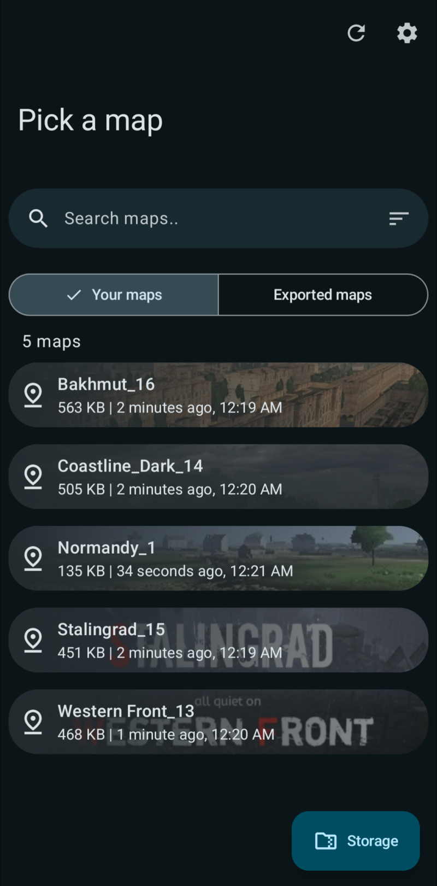

<div align="center">

  
  
  # PF Tool
  Easily import and share <a href="https://play.google.com/store/apps/details?id=com.MA.Polyfield">Polyfield</a> maps
  
  <br>

  [](https://github.com/aliernfrog/pf-tool/releases/latest/download/pftool.apk)

  <br>

  
  

  ---
  
  
  
</div>

## 🦝 Shizuku support
[Shizuku](https://play.google.com/store/apps/details?id=moe.shizuku.privileged.api) is an app which lets other apps elevate their permissions using wireless debugging (or root, if you have one).

Shizuku method in PF Tool can be enabled or disabled anytime from settings.

Shizuku method will automatically be enabled if there is no other way for the app to access Polyfield data. The app will guide you to setup Shizuku if this mode is enabled.

## 🔧 Building
<details>
  <summary>Using GitHub Actions</summary>

  - Fork the repository
  - Add environment variables required for signing from **Repository settings > Secrets and variables > Actions > Repository secrets**:
    - `KEYSTORE_ALIAS`
    - `KEYSTORE_BASE64` this can be obtained using `openssl base64 keystore.jks`
    - `KEYSTORE_PASSWORD`
    - `KEY_PASSWORD`
  - Enable workflows
  - Trigger a build workflow and wait for it to build a release variant APK
</details>
<details>
  <summary>Locally</summary>

  - Clone the repository
  - Add a signing config (unless you only want to build debug variant or sign manually)
  - Obtain a GitHub PAT with `read:packages` scope
  - Put the PAT and your GitHub username in global/project `gradle.properties`:
    ```
    gpr.user=MyUserName
    gpr.key=MyPAT
    ```
    or supply `GITHUB_ACTOR` (username) and `GITHUB_TOKEN` (PAT) in environment variables
  - Build APK:
    - Release variant: `./gradlew assembleRelease`
    - Debug variant: `./gradlew assembleDebug`
</details>
