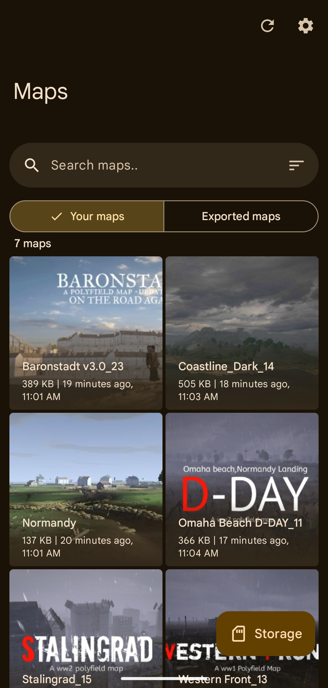
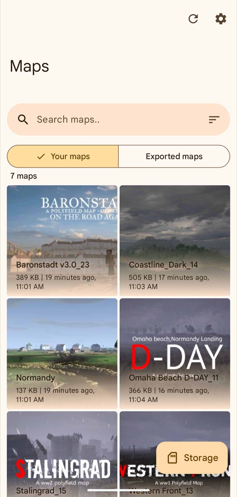

  
  
  # PF Tool
  Easily import and share <a href="https://play.google.com/store/apps/details?id=com.MA.Polyfield">Polyfield</a> maps
  
   

  
  
  <i style="font-size: 0.7rem;">At least <b>Android 5.0</b> is required</i>
  
   

  
  

  ---
  
  
  
  

## 🌍 Translations
You can help translate PF Tool on [Crowdin](https://crowdin.com/project/pf-tool).

## 🦝 Shizuku support
[Shizuku](https://play.google.com/store/apps/details?id=moe.shizuku.privileged.api) is an app which lets other apps elevate their permissions using wireless debugging or root access.

Shizuku method in PF Tool can be enabled or disabled anytime from settings.

Shizuku method will automatically be enabled if there is no other way for the app to access Polyfield data. The app will guide you to setup Shizuku if this mode is enabled.

## ⚖️ License
Since commit [`dfc783f`](https://github.com/aliernfrog/pf-tool/commit/dfc783f9b0740e357f229175c0be94d1bdeadda5), PF Tool is licensed under the GPLv3 license. 
You must keep the source code public if you are distributing your own version of PF Tool. See [LICENSE.md](LICENSE.md) file for more details.

## 🔧 Building

  
Using GitHub Actions

  - Fork the repository
  - Add environment variables required for signing from **Repository settings > Secrets and variables > Actions > Repository secrets**:
    - `KEYSTORE_ALIAS`
    - `KEYSTORE_BASE64` this can be obtained using `openssl base64 -in keystore.jks`
    - `KEYSTORE_PASSWORD`
    - `KEY_PASSWORD`
  - Enable workflows
  - Trigger a build workflow and wait for it to build a release variant APK

  
Locally

  - Clone the repository
  - Add a signing config (unless you only want to build debug variant or sign manually)
  - Build APK:
    - Release variant: `./gradlew assembleRelease`
    - Debug variant: `./gradlew assembleDebug`

